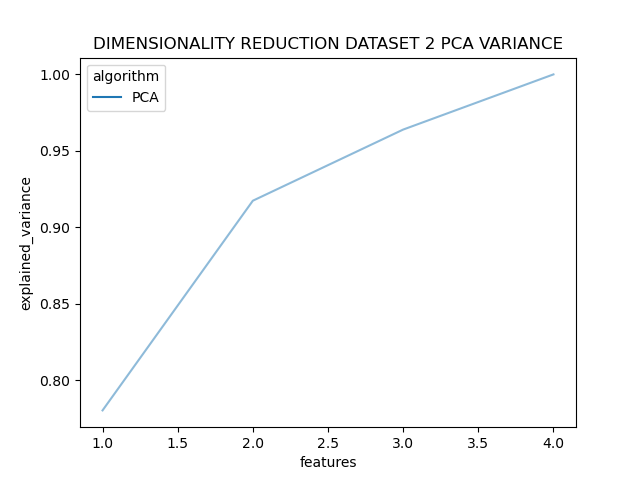

##### Assignment 3 - CS 7641 - Joshua Ruf

### Datasets:

For both datasets I normalize the features to be within the range -1 and 1.

##### Dataset 1

This dataset consists of a number of employees, their pre hire survey scores (questions about their strengths and weaknesses) as well as some basic demographic features. In the first assignment I predicted whether the employee would be employed after 6 months. The dataset is quite wide with 48 features and 2739 observations. The features in this dataset are somewhat clustered in that there are a bunch of boolean values that correspond to strengths, and another group that corresponds to weaknesses. As well demographic features are another set. All in all I think there is a fair bit of room to go with dimensionality reduction and I expect the clustering algorithms to perform poorly until such measures are taken. The features are coarsely listed below (these will help get a sense of clusters):

- 0 is_manager
- 1-3 composite of survey information
- 4 age_at_hire
- 5 was_referral
- 6-22 strength booleans
- 23-32 weakness booleans
- 33-41 compared to others (rated 1-5)
- 42-47 demographic booleans

##### Dataset 2

This dataset consists of transformed movie reviews from the website rogerebert.com for all 3.5 and 4 star reviews. The idea was to predict what movies since his death in 2013 should be given the classification "great movie" as the critics that took over his site have refrained from using that distinction. The text reviews were passed to NLTK's simple sentiment analysis which for each review simply creates an index for the number of positive, negative, neutral, and compound score which is some transformation of the first three. I think the fact that this feature contains information about the first three features will result in some interesting results. I also included the review length in characters. In total there are 2415 observations and 5 features.

### Clustering

#### KMeans

##### Dataset 1

We see from a silhouette analysis that 5 clusters is the chosen optimum. The silhouette metric compares the intra-cluster distance to the mean nearest inter-cluster distance. Scores range between -1 and 1, with positive being more desirable clusters. Scores below zero are thought to mean that the sample is assigned to the wrong cluster.

Here we visualize the first two principle components such that we can see how varied these clusters are (at least amongst the dimensions with the highest variance). It seems like clusters 1, 2, and 3 are more or less distinct in these two dimensions, however clusters 4 and 5 are overlaid with no clear decision boundary. This makes sense as the data is quite wide and the first two principle components do not capture a high amount of variance. As such in a higher dimensional space we can expect the clusters 4 and 5 to vary on other dimensions.

Below we see a visual representation of the five clusters and their means across all 48 features. This is hard to read but each x axis value corresponds to a feature by index, the y axis is the mean of that feature, and the different color/style lines correspond to each cluster. Here's what we can take away from this:

1. the is manager field is quite varied across clusters
2. composite scores are not varied across clusters
3. strengths (features 6-22) are quite varied, cluster 1 could be thought of as "low potential" since the average strengths are all quite low
4. compared to others fields are almost completely overlapping
5. demographic features (the final 41-47) are all over the place, the algorithm seems to suggest that gender is not helpful for distinguishing between clusters but ethnicity is!

##### Dataset 2

With only 5 features it makes sense that the number of clusters is unlikely to be past 5. Based on the silhouette analysis 2 seems to be the optimal.

More than that, plotting the two clusters on top of the first two principle components, we see that the first principle component is sufficient to split the clusters in two. No surprise then that two clusters was chosen. This is only possible for this dataset I imagine because of how few features there were to start.

The neutral words feature is least used to distinguish between clusters which makes sense. Conversely, the compound words feature is the most used, likely since it is already a combination of the relevant information. As well the review length in text characters is not used, since this probably has a large amount of variance.

#### EM

##### Dataset 1

Interestingly, with the same silhouette approach EM chose 2 clusters. This is the number of classes in the original prediction problem so in some ways this is encouraging. That said, the silhouette scores are a fair bit lower than KMeans, indicating that the EM algorithm might not be as well suited to the problem. I would guess that EM's assigning probabilities instead of hard cluster thresholds means that the decision boundary is less defined.

Indeed that appears to be the case, with the exception of a tight cluster of points on the far right side of the 0th PC the 0th cluster basically surrounds the 1st cluster.

##### Dataset 2

Like KMeans, EM also chose 2 clusters as the optimum. When plotted on the two first principle components however we see that the split is nowhere near as even for EM, and the decision boundary is very overlapping. This must mean that the clusters rely on other dimensions more for EM than KMeans.

### Dimensionality Reduction

##### Dataset 1

On the x axis I've plotted number of features and on the y axis I've plotted the root mean squared difference between the original data and the data transformed into the smaller space and then projected back into the original space. This can be thought of as a measure of information loss since rmse of zero means that no information is stripped away while higher values correspond to more information loss. Looking at the figure there are a few things to note:

1. the curvature of the relationship between number of features and information loss is different for each algorithm: PCA and ICA have a nice kink around feature 34 indicating that there are much more diminishing returns of adding features beyond that point. Variance Threshold is more linear with a smaller kink around the same place. Random Projections however have the opposite curve, indicating that the information gain (at least according to the crude RMSE metric being used) is actually greatest at about feature 35. This is totally possible since by choosing randomly the likelihood of choosing the most useful features increases as more features are chosen overall.
2. the PCA and FastICA algorithms return almost the same results (blue plus orange line combines in seaborn to a nice brown). I'm a bit surprised by this, maybe for this particular dataset the orthogonality and statistical dependence achieve similar results.
3. None of the algorithms point to there being just a handful of features that explain a large amount of the information contained in the original data.
4. It makes sense to me that PCA and ICA would retain the most information, the randomized projections is a faster version of PCA (sacrificing choosing the optimal direction of variance) and variance threshold is just a much simpler approach that does not consider features together at all.

Overall I'm not surprised, going into this (as well as the first) assignment, I knew this data contained a lot of noise and perhaps even measurement error such that dimensionality reduction is necessary but also bounded in its utility.

These results are confirmed more or less by the variance explained, obtained from the eigenvalues of the PCA algorithm. Again, around feature 34 the additional variance explained by the last features is quite low. There appears to be a slight kind around feature 10, but it's very minor.

##### Dataset 2

This dataset exhibits similar dynamics as the first dataset, however since there are so many fewer features the curvature is much less defined. Still PCA and FastICA achieve similar results, according to RMSE compared to the original feature space.

Based on a visual inspection of the cumulative variance of the principle components, there seems to be just two components that explain roughly 92% of the variance in the data.

#### Understanding PCA's top components

##### Dataset 1

Using the same approach as above to understand KMean's clusters, below I plot the loading matrix for the top 5 principle components to get a sense of how they vary. I did not plot all 17 since it would be illegible. Interestingly, we see a similar pattern as with the 5 clusters from KMeans: the manager feature varies across components and the "compared to others" fields don't seem to vary". As well, the ethnicity features vary more than the gender features, and the strength features vary more than the weakness features.

##### Dataset 2

Like the 2 KMeans clusters, the review length does not influence the principle components very much, however the neutral words do play a role.

#### Understanding ICA's top components

##### Dataset 1

Running the same kind of analysis for ICA we see that instead of combining all features into components, the algorithm instead pulls out single original features that it seems the most important. This is consistent with what we learned in lecture whereby the "concepts" outlined by ICA are more understandable than PCA (at least for humans). Here it looks like a few distinct strengths, a weakness, and a demographic feature are identified as the main influencers of the ICA components.

##### Dataset 2

ICA also does not favour the review length feature, and does rely on the compound feature. Generally though, on this dataset the difference between ICA and PCA is not very stark. I suppose this could mean that the features in dataset 2 (since there are far fewer of them) are all at least somewhat useful, whereas the first dataset contained lots of redundancy. This also is consistent with the manner of data preprocessing I did on this dataset, I took raw text and passed it into a sentiment analyzer, already performing a kind of variable selection/dimensionality reduction technique. If instead I created binary variables for the individual words then these techniques might have been more useful. I think the lesson here is clear: as the feature space grows the need for dimensionality reduction grows with it to avoid the curse of dimensionality. This is not revolutionary, however it is well demonstrated through comparing the two datasets.

### Clustering After Dimensionality Reduction

##### Dataset 1

While the visualizations above show that 32-34 is likely the optimal number of features to reduce to, I chose to reduce it more to get a better sense of how the clustering algorithms perform with a much smaller feature space. I chose 17 features, ran all four dimension reduction techniques and passed them to the two clustering algorithms. As before, EM chooses k=2 across all dimension reduction techniques. Interestingly, KMeans now does the same for most dimension reduction techniques, PCA being the only exception. Overall, we do see that the silhouette metrics are generally higher than with the full feature space. I think the combination of all silhouette scores being higher but the clustering algorithms preferring to use only one cluster is interesting. To me, it implies that the data does not have clear clusters.

Showing the same first and second principle components, we see an almost identical story, indicating that the clusters have not moved much as a result of removing the least useful features.

##### Dataset 2

Still, we see that 2 clusters are optimal. This makes sense since there are not very many features to start such that dimensionality reduction is less necessary than in the first problem.

### Neural Network

#### Full feature vs reduced feature dataset, predicting labels

I ran the neural network from the first assignment on dataset 1 twice using the same hyperparameters in the grid search cross validation. The first time I used the full featured dataset with 48 features, while the second time I used only the 17 features selected by PCA. In both scenarios I upsampled the minority class to deal with class imbalance, and used f1-score as the selection metric in cross validation. As such, the training accuracy score is not that helpful as it runs on the upsampled data.

Unsurprisingly, the reduced feature dataset trained in less than half the time of the full feature dataset, 0.088s to 0.22s -- the numbers are not that different but remember there are just under 3000 training samples. The two models performed very similarly in terms of f1 score. In training, the best CV f1 score was 0.6658 for the smaller dataset compared to 0.6688 for the larger dataset. Testing on unseen data, the smaller model achieved an f1 score of 0.2261, and the larger model achieved an f1 score of 0.2269. That said, with the reduced training time, the smaller model is likely the better bet. Surprisingly the larger model opted to use a hidden layer with 2 neurons while the smaller model used 8 neurons. One would expect the opposite so I am of the opinion that this relates back to the original problems working with this data in assignment 1: it's really noisy. Since these data describe employment and pre hire surveys the data can be highly subjective and employees leave roles for any number of reasons that might not be predictable in data.

#### Full feature vs reduced feature dataset, predicting clusters

Using the reduced feature data, I predicted the clusters obtained using KMeans with k=2 since the original labels have two classes. This means compare the neural network's ability to predict the labels in the same way as the clusters. As well, we can begin by seeing how well the clusters approximate the labels. In our data the labels match the clusters with an accuracy of 72% and this corresponds to an f1-score of about 0.32 for comparison. This should not be thought of as a measure of how well KMeans performs because our original labels could have been very poorly designed and contain no information at all - were that the case it does not reflect badly on the clustering algorithm but instead the practitioner (or the data).

Overall, the neural network had a comparatively easy time predicting the clusters as compared to the actual labels. For both f1 score and accuracy it achieved train and test scores of over 99%. This speaks to the way in which the means are constructed, and ease with which a neural network can learn that kind of linear function. Since the clusters are born out of the data itself, there is effectively no redundant information, every feature is used in the construction of a cluster. It seems likely then, that by the universal approximation theorem, a neural network with 3 sufficiently large hidden layers can predict the clusters coming from a KMeans algorithm with arbitrarily high precision. Furthermore, a number of models fit in this CV process were stopped early by reaching the max number of iterations, further indication that improving upon the accuracy is possible.

